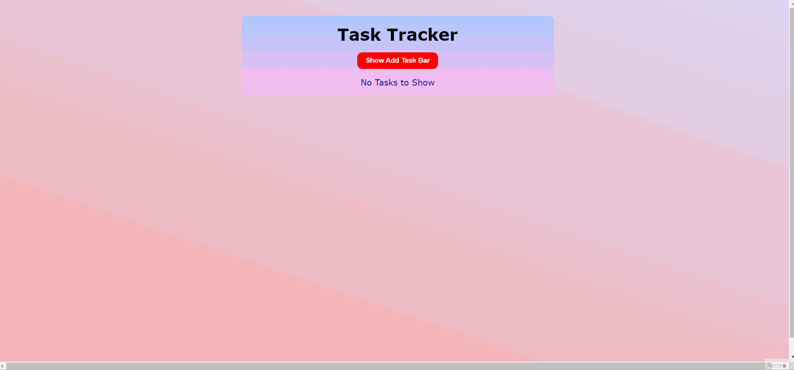

[👉 click here to view the page](https://msaiduslu.github.io/task-tracker/)

# Project : Task Tracker

## Description

Project aims to create a Task Tracker App.

## Project Skeleton

```
Task Tracker (folder)
|
|----readme.md
├── public
│     └── index.html
├── src
│    ├── components
│    │       ├── AddTask.jsx
│    │       ├── Header.jsx
│    │       ├── Task.jsx
│    │       ├── TaskList.jsx
│    │       │
│    │
│    ├── App.js
│    ├── App.css
│    ├── index.js
│    └── index.css
├── package.json
└── yarn.lock
```

### At the end of the project, following topics are to be covered;

- React Hooks

- React Props

- React Icons

- Local Storage

- ReactJS

### At the end of the project, i will be able to;

- improve coding skills within HTML & CSS & JS & ReactJS.

- use git commands (push, pull, commit, add etc.) and Github as Version Control System.
